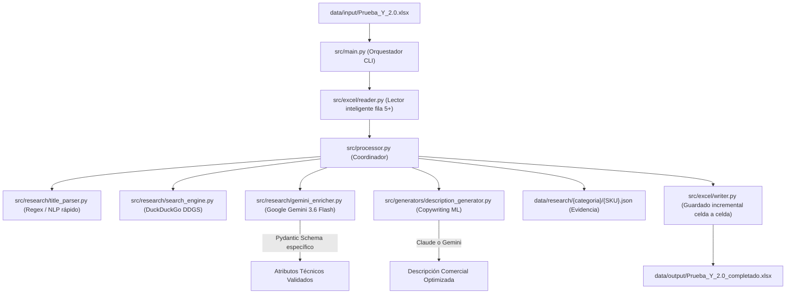

# Pipeline de Catalogación y Enriquecimiento Multicategoría para Mercado Libre (Urbanova / Toptek)

Sistema automatizado de catalogación, investigación técnica y generación de descripciones para e-commerce / Mercado Libre, diseñado para procesar de forma **modular, incremental y desacoplada** múltiples familias de motorefacciones (Carburadores, Kits de Sprockets, Barras de Suspensión, Salpicaderas, y cualquier categoría futura).

---

## Arquitectura General y Flujo de Trabajo

El sistema desacopla el motor de ejecución de la definición técnica de cada categoría mediante un enfoque **Schema-Driven**:



---

## Estructura del Proyecto

```text
Trabajo_integracion_Urbanova/
├── config/
│   ├── settings.py                  # Variables de entorno, modelos LLM y rutas
│   └── categories/                  # Definición declarativa por categoría
│       ├── carburadores.yaml        # Reglas y mapeo para Carburadores
│       ├── kits_sprockets.yaml      # Reglas y mapeo para Kits de Sprockets
│       ├── barras_suspension.yaml   # Reglas y mapeo para Barras de Suspensión
│       ├── salpicaderas.yaml        # Reglas y mapeo para Salpicaderas
│       └── registry.py              # Registro dinámico de categorías
├── knowledge/
│   └── motorcycles.json             # Base de conocimiento (marcas, modelos, specs base)
├── schemas/
│   └── models.py                    # Modelos Pydantic (CarburadorAttributes, SprocketAttributes...)
├── src/
│   ├── main.py                      # Punto de entrada CLI
│   ├── processor.py                 # Procesador unificado de filas
│   ├── excel/
│   │   ├── reader.py                # Lector multi-hoja (salta metadatos filas 2-4)
│   │   └── writer.py                # Escritor incremental celda a celda
│   ├── research/
│   │   ├── title_parser.py          # Extractor regex/NLP rápido (costo $0)
│   │   ├── search_engine.py         # Motor de búsqueda web con caché
│   │   └── gemini_enricher.py       # Enriquecedor estructurado con Gemini (JSON Schema)
│   └── generators/
│       └── description_generator.py # Generador de descripciones comerciales (Claude / Gemini)
├── data/
│   ├── input/                       # Archivos Excel de origen
│   ├── output/                      # Archivos completados de salida
│   └── research/                    # Archivos JSON de evidencia técnica por SKU
├── .env.example                     # Plantilla de variables de entorno
└── leer.txt                         # Documento de contexto y requerimientos
```

---

## Instalación y Configuración

1. **Crear entorno virtual e instalar dependencias:**
   ```bash
   python3 -m venv .venv
   source .venv/bin/activate
   pip install openpyxl pyyaml pydantic google-genai anthropic ddgs duckduckgo-search python-dotenv
   ```

2. **Configurar claves de API:**
   Copia el archivo `.env.example` a `.env` y coloca tu API Key de Gemini (y opcionalmente de Claude):
   ```bash
   cp .env.example .env
   ```

---

## Uso del Pipeline

### Procesar todo el libro Excel:
```bash
python src/main.py Prueba_Y_2.0.xlsx
```

### Procesar una sola categoría / hoja:
```bash
python src/main.py Prueba_Y_2.0.xlsx --sheet "Carburadores"
python src/main.py Prueba_Y_2.0.xlsx --sheet "Kits de sprockets"
python src/main.py Prueba_Y_2.0.xlsx --sheet "Barras de suspensión"
python src/main.py Prueba_Y_2.0.xlsx --sheet "Salpicaderas"
```

### Pruebas rápidas con límite de filas:
```bash
python src/main.py Prueba_Y_2.0.xlsx --limit 3
```

### Procesar un SKU específico:
```bash
python src/main.py Prueba_Y_2.0.xlsx --sku "ENG-1505-0101"
```

### Forzar reprocesamiento de filas ya llenas:
```bash
python src/main.py Prueba_Y_2.0.xlsx --force
```

---

## ¿Cómo agregar una NUEVA categoría de producto en el futuro?

Para incorporar cualquier refacción nueva (ejemplo: *Discos de freno* o *Balatas*):

1. **Crear el Schema Pydantic en `schemas/models.py`:**
   ```python
   class DiscoFrenoAttributes(BaseProductAttributes):
       diametro_exterior: float
       diametro_interior: float
       cantidad_barrenos: int
       material: str = "Acero inoxidable"
   ```
2. **Crear la configuración en `config/categories/discos_freno.yaml`:**
   ```yaml
   name: "Discos de freno"
   sheet_name: "Discos de freno"
   schema_name: "DiscoFrenoAttributes"
   start_row: 5
   column_mapping:
     marca: "Marca"
     numero_de_parte: "Número de parte"
     diametro_exterior: "Diámetro exterior"
     material: "Material"
     descripcion_comercial: "Descripción"
   ```
3. ¡Listo! El sistema reconocerá automáticamente la nueva hoja y la procesará de forma incremental sin modificar el código principal.
